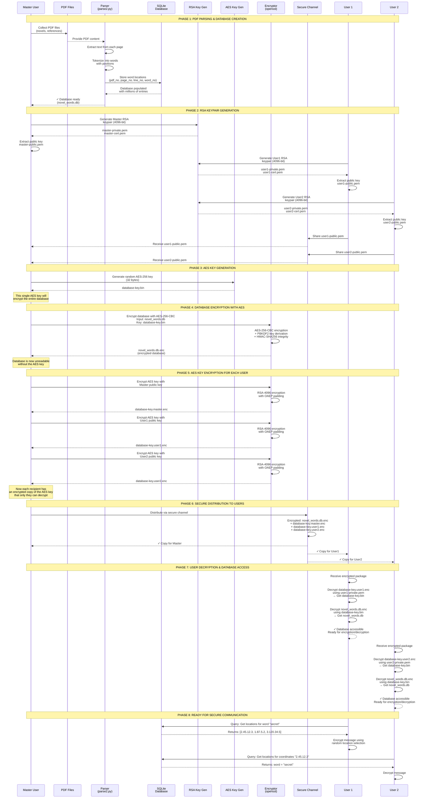

# Location-Based Encryption: Building a PDF-Backed Cipher System

## Introduction

Imagine an encryption system where the encryption key isn't a random string of characters, but rather the content of PDF files themselves. Felt this is a brilliant concept behind our location-based encryption system—a novel approach that turns words hidden in PDF documents into coordinates, creating a cipher that's as unique and complex as the source material.

This blog explores how our system combines **PDF parsing**, **location-based encryption**, and **decryption** using a centralized SQLite database, along with enterprise-grade key management for multi-user environments.

---

## Part 1: Parsing PDFs – Building the Foundation

### What Is PDF Parsing in This Context?

Our system doesn't just read PDFs—it *indexes* them. Parsing here means extracting every word from PDF documents and recording their precise location: PDF number, page number, line number, and word position. This creates a comprehensive map of all words across all documents.

### The Parsing Pipeline

The parsing process works like this:

1. **Document Collection**: Gather all PDF files (novels, word lists, reference materials)
2. **Page Extraction**: Use `pdfplumber` to extract text from each page
3. **Line Segmentation**: Break each page into individual lines
4. **Word Tokenization**: Split lines into individual words using regex patterns
5. **Position Recording**: Store each word with its complete location coordinates

```python
# Example from parse2.py
def extract_and_store_words(pdf_path, pdf_no, conn, cursor):
    with pdfplumber.open(pdf_path) as pdf:
        for page_no in range(len(pdf.pages)):
            page = pdf.pages[page_no]
            text = page.extract_text()
            lines = text.splitlines()
            
            for line_no, line in enumerate(lines, 1):
                words = re.findall(r"\b\w+(?:['-]\w+)*\b", line)
                for word_no, word in enumerate(words, 1):
                    # Store: word, pdf_no, page_no, line_no, word_no
                    cursor.execute("""
                        INSERT INTO word_locations 
                        VALUES (?, ?, ?, ?, ?)
                    """, (word, pdf_no, page_no, line_no, word_no))
```

### The Database Structure

All parsed data lives in a SQLite database with a simple but powerful schema:

```sql
CREATE TABLE word_locations (
    word TEXT,
    pdf_no INTEGER,
    page_no INTEGER,
    line_no INTEGER,
    word_no INTEGER,
    PRIMARY KEY (pdf_no, page_no, line_no, word_no)
)
```

Each row represents one word's location. For example:
- `word="fox"` → `pdf_no=2, page_no=5, line_no=3, word_no=7`
- `word="jumps"` → `pdf_no=1, page_no=12, line_no=8, word_no=15`

### Why This Matters

Traditional encryption uses mathematical keys that are abstract and uniform. Our system uses **content-based location coordinates**. A word like "fox" might appear in dozens of different PDFs and locations. This creates an enormous keyspace—each word in your message can be represented by *any of its locations* in the database.

### Parsing Challenges We Solved

- **Handling Special Characters**: Regex patterns preserve contractions and hyphens while separating punctuation
- **Case Normalization**: All words stored in lowercase for consistent lookups
- **Duplicate Prevention**: PRIMARY KEY constraint prevents storing the same position twice
- **Performance at Scale**: Indexed lookups handle thousands of words efficiently

---

## Part 2: Encryption – From Words to Coordinates

### The Concept: Location-Based Cipher

Instead of traditional character substitution or mathematical transformation, our encryption system replaces words with their location coordinates in the PDF database. A message like "The Fox is jumping" becomes something like "2.201.8.1 2.45.12.3 1.87.5.2 3.120.34.5"—a sequence of PDF locations.

### The Encryption Algorithm

Encryption is elegantly simple:

1. **Input**: Take plaintext message
2. **Tokenize**: Split into words, spaces, and punctuation
3. **Preserve Formatting**: Keep spaces and punctuation intact
4. **Look Up Words**: For each word, query the database for all its locations
5. **Random Selection**: Choose a random location from available options
6. **Replace**: Substitute the word with coordinates (pdf_no.page_no.line_no.word_no)
7. **Join**: Combine all tokens back together

```python
# From enc2.py - The actual encryption logic
def encrypt_text(input_text, db_name="novel_words.db"):
    conn, cursor = connect_to_database(db_name)
    
    # Tokenize while preserving spaces and punctuation
    tokens = re.findall(r'\b\w+\b|[^\w\s]|\s+', input_text, re.UNICODE)
    encrypted_tokens = []

    for token in tokens:
        if token.isspace():
            # Keep spaces as-is
            encrypted_tokens.append(token)
        elif not re.match(r'\b\w+\b', token):
            # Keep punctuation as-is
            encrypted_tokens.append(token)
        else:
            # This is a word - encrypt it
            locations = get_word_locations(token, cursor)
            if locations:
                # Choose random location
                selected = random.choice(locations)
                pdf_no, page_no, line_no, word_no = selected
                encrypted_tokens.append(f"{pdf_no}.{page_no}.{line_no}.{word_no}")
            else:
                # Unknown word - mark with brackets
                encrypted_tokens.append(f"[{token}]")
    
    return "".join(encrypted_tokens)
```

### A Concrete Example

**Original Message:**
```
"The Fox is jumping!"
```

**Database Lookup Results:**
- "the" appears at: [1.5.2.1, 2.12.4.3, 3.8.1.1, ...]  (many locations)
- "fox" appears at: [2.45.12.3, 3.120.34.5]  (fewer locations)
- "is" appears at: [1.87.5.2, 1.200.10.4, ...]  (many locations)
- "jumping" appears at: [3.220.8.9]  (only one location)

**After Encryption (random choices):**
```
"3.8.1.1 2.45.12.3 1.87.5.2 3.220.8.9!"
```

Every word is replaced by its location coordinates. The spaces and punctuation are preserved perfectly.

### Why This Is Secure

1. **Massive Keyspace**: With thousands of unique words and potentially hundreds of locations per word, the number of possible encryptions for a single message is astronomical.

2. **Non-Deterministic**: The same message encrypted twice produces completely different output (thanks to random location selection).

3. **Database Dependency**: The encryption key is the PDF database itself. Without access to the database, coordinates are meaningless.

4. **One-Time Pad Analogy**: Each word can use a different location, similar to a one-time pad's randomness.

### Multi-User Encryption with RSA & AES

For enterprise security, the system implements a **Master-User model**:

1. **Master User** creates and maintains the database
   - Generates RSA-4096 key pair (master-private.pem, master-cert.pem)
   - Encrypts the database with AES-256-CBC

2. **Regular Users** have their own keys
   - Generate their own RSA key pairs
   - Share their public key with the master

3. **Secure Distribution**
   - Master generates a random AES key for the database
   - Encrypts the database with AES-256-CBC
   - Encrypts the AES key separately for each user using their RSA public key
   - Distributes encrypted database + encrypted keys

4. **User Decryption**
   - User decrypts their copy of the AES key using their private RSA key
   - Uses the AES key to decrypt the shared database
   - Can now perform encryption/decryption operations

This hybrid approach combines the security of RSA with the performance of AES:

```
┌─────────────────────────────────────────────────────────┐
│  Database (novel_words.db)                              │
└─────────────────────────────────────────────────────────┘
                        ↓
         Encrypt with random AES key (256-bit)
                        ↓
         ┌──────────────────────────────────┐
         │  Encrypted Database              │
         │  (AES-256-CBC + HMAC-SHA256)     │
         └──────────────────────────────────┘
                        ↓
         (Shared with all users via secure channel)
                        ↓
    ┌────────────────────┬────────────────────┐
    ↓                    ↓                    ↓
Encrypt AES key   Encrypt AES key    Encrypt AES key
with Master       with User1 RSA     with User2 RSA
public key        public key         public key
    ↓                    ↓                    ↓
DB-key.master.enc DB-key.user1.enc   DB-key.user2.enc
```

### Database as the Encryption Key

Unlike traditional encryption where keys are random, the "key" here is the parsed PDF content. This provides several advantages:

- **Reproducibility**: Same input + same database = same encryption possibilities
- **Content-Aware**: More frequently appearing words offer more location options
- **Scalability**: Adding more PDFs increases security (more location options per word)

---

## Part 3: Decryption – Recovering the Original Message

### The Reverse Process

Decryption is the elegant inverse of encryption. Instead of looking up words to find coordinates, we look up coordinates to find words.

### The Decryption Algorithm

```go
// From ipcrypt.go - The decryption mechanism in Go
func getWordAtLocation(db *sql.DB, item location) (string, bool, error) {
    var word string
    err := db.QueryRow(`
        SELECT word
        FROM word_locations
        WHERE pdf_no = ? AND page_no = ? AND line_no = ? AND word_no = ?`,
        item.pdfNo, item.pageNo, item.lineNo, item.wordNo).Scan(&word)
    
    if err == sql.ErrNoRows {
        return "", false, nil  // Location not found
    }
    if err != nil {
        return "", false, err  // Database error
    }
    return word, true, nil     // Word found
}
```

The decryption process:

1. **Parse Ciphertext**: Split encrypted message into tokens (coordinates and punctuation)
2. **Identify Coordinate Tokens**: Recognize the pattern `pdf_no.page_no.line_no.word_no`
3. **Preserve Formatting**: Keep spaces and punctuation intact
4. **Look Up Locations**: For each coordinate, query the database
5. **Retrieve Words**: Extract the word stored at that exact location
6. **Reconstruct**: Join words, spaces, and punctuation back together

### A Concrete Example

**Encrypted Message:**
```
"3.8.1.1 2.45.12.3 1.87.5.2 3.220.8.9!"
```

**Database Lookups:**
- Location `3.8.1.1` → word `"the"`
- Location `2.45.12.3` → word `"fox"`
- Location `1.87.5.2` → word `"is"`
- Location `3.220.8.9` → word `"jumping"`

**Decrypted Message:**
```
"the fox is jumping!"
```

### Why Both Parties Need the Database

For decryption to work:
- **Sender** needs the database to encrypt (look up words → get coordinates)
- **Receiver** needs the **same database** to decrypt (look up coordinates → get words)

This is fundamentally different from traditional encryption where you encrypt with a public key and decrypt with a private key. Here, encryption and decryption are both symmetric operations that depend on the same shared resource: the PDF database.

### Error Handling

What if a location is missing or corrupted?

```go
func randomIndex(n int) (int, error) {
    if n <= 0 {
        return 0, fmt.Errorf("random index requires a positive size")
    }
    if n == 1 {
        return 0, nil
    }
    v, err := rand.Int(rand.Reader, big.NewInt(int64(n)))
    if err != nil {
        return 0, err
    }
    return int(v.Int64()), nil
}
```

The system gracefully handles:
- **Missing locations**: Returns an error indicating the coordinate doesn't exist
- **Corrupted database**: Database integrity checks catch inconsistencies
- **Unknown words**: Encryption marks them with brackets [word] for manual handling

### Symmetric Nature of the System

Unlike public-key cryptography, this system is **symmetric**: both encryption and decryption require the exact same database. This means:

- **Advantage**: Simple, efficient, fast
- **Consideration**: The database itself is the shared secret—it must be protected and distributed securely

---

## Part 4: The Complete System – Parsing, Encryption, and Database Management

### System Architecture

Our location-based encryption system combines three layers:

```
┌──────────────────────────────────────────────────────────┐
│ LAYER 1: PDF PARSING & DATABASE CREATION                │
├──────────────────────────────────────────────────────────┤
│ Input: PDF Files (novels, word lists, documents)         │
│ Process: Extract text, tokenize, record locations        │
│ Output: SQLite Database (word_locations table)           │
└──────────────────────────────────────────────────────────┘
                         ↓
┌──────────────────────────────────────────────────────────┐
│ LAYER 2: DATABASE ENCRYPTION & KEY MANAGEMENT            │
├──────────────────────────────────────────────────────────┤
│ Input: SQLite Database                                   │
│ Process: Generate keys, encrypt DB, distribute securely  │
│ Output: Encrypted DB + Encrypted keys per user           │
└──────────────────────────────────────────────────────────┘
                         ↓
┌──────────────────────────────────────────────────────────┐
│ LAYER 3: MESSAGE ENCRYPTION & DECRYPTION                 │
├──────────────────────────────────────────────────────────┤
│ Input: Plaintext message                                 │
│ Process: Encrypt using DB lookups (random location pick) │
│ Output: Location-based ciphertext                        │
│ Reverse: Decrypt by looking up coordinates in DB        │
└──────────────────────────────────────────────────────────┘
```

### Database Generation and Distribution Sequence

Here's a detailed sequence diagram showing the complete workflow of how the database is generated, encrypted, and securely distributed to multiple users:



**Key Points from the Sequence:**

1. **PHASE 1**: Database built by parsing PDFs into word locations
2. **PHASE 2**: Each user generates their own RSA keypair; public keys shared with Master
3. **PHASE 3**: Master generates a single AES-256 key for database encryption
4. **PHASE 4**: Database encrypted with AES (symmetric, fast)
5. **PHASE 5**: AES key encrypted separately for each user with their RSA public key
6. **PHASE 6**: All encrypted materials distributed via secure channel
7. **PHASE 7**: Each user decrypts their AES key (asymmetric, secure key exchange), then decrypts the database
8. **PHASE 8**: All users now have the same database and can encrypt/decrypt messages together

This hybrid approach provides both security (RSA for key distribution) and efficiency (AES for data encryption).

### A Complete Example: The Data Journey

#### Step 1: PDF Parsing and Database Creation

```python
# Administrator builds the encryption foundation
pdf_files = ["novel1.pdf", "reference.pdf", "words.pdf"]

for pdf_no, pdf_file in enumerate(pdf_files, 1):
    extract_and_store_words(pdf_file, pdf_no, conn, cursor)

# Database now contains millions of word locations:
# word: "confidential" | pdf_no: 2 | page_no: 45 | line_no: 12 | word_no: 8
# word: "confidential" | pdf_no: 3 | page_no: 8  | line_no: 3  | word_no: 2
# ... and millions more
```

#### Step 2: Database Encryption and Secure Distribution

```bash
# Master generates the AES encryption key
openssl rand -out database-key.bin 32

# Encrypt the database with AES-256-CBC
openssl enc -aes-256-cbc -salt -pbkdf2 -md sha256 \
  -in novel_words.db -out novel_words.db.enc \
  -pass file:database-key.bin

# For each user, encrypt the AES key with their RSA public key
openssl pkeyutl -encrypt -pubin -inkey user1-public.pem \
  -in database-key.bin -out database-key.user1.enc \
  -pkeyopt rsa_padding_mode:oaep -pkeyopt rsa_oaep_md:sha256

# User1 later decrypts their copy of the key
openssl pkeyutl -decrypt -inkey user1-private.pem \
  -in database-key.user1.enc -out database-key.bin \
  -pkeyopt rsa_padding_mode:oaep -pkeyopt rsa_oaep_md:sha256

# And decrypts the database
openssl enc -d -aes-256-cbc -salt -pbkdf2 -md sha256 \
  -in novel_words.db.enc -out novel_words.db \
  -pass file:database-key.bin
```

#### Step 3: Message Encryption

```
User1 wants to send: "Increase budget allocation"

Lookup database:
- "increase" found at 3 locations: [2.15.3.9, 1.200.5.2, 3.45.1.1]
- "budget" found at 1 location: [2.87.20.5]
- "allocation" found at 2 locations: [1.450.8.3, 3.12.44.6]

Randomly choose from options:
- "increase" → 1.200.5.2 (random pick)
- "budget" → 2.87.20.5 (only option)
- "allocation" → 3.12.44.6 (random pick)

Encrypted message sent: "1.200.5.2 2.87.20.5 3.12.44.6"
```

#### Step 4: Message Decryption

```
User2 receives: "1.200.5.2 2.87.20.5 3.12.44.6"

Lookup database:
- Query: SELECT word FROM word_locations 
         WHERE pdf_no=1 AND page_no=200 AND line_no=5 AND word_no=2
  Result: "increase"

- Query: SELECT word FROM word_locations 
         WHERE pdf_no=2 AND page_no=87 AND line_no=20 AND word_no=5
  Result: "budget"

- Query: SELECT word FROM word_locations 
         WHERE pdf_no=3 AND page_no=12 AND line_no=44 AND word_no=6
  Result: "allocation"

Decrypted message: "Increase budget allocation"
```

### Database Optimization

To handle large PDFs efficiently, the system includes optimization tools:

- **compactor.py**: Reduces database size by removing unused entries
- **reducer.py**: Consolidates word locations and eliminates redundancy
- **optimizer.py**: Creates indexes and optimizes query performance

These tools ensure the database remains performant even with thousands of PDFs and millions of word locations.

### Key Management Workflow

```
┌─────────────────────────────────────────────────────────┐
│ MASTER USER CREATES SYSTEM                              │
├─────────────────────────────────────────────────────────┤
│ 1. Generate RSA keypair (4096-bit)                       │
│ 2. Create/maintain SQLite database                       │
│ 3. Generate random AES-256 key                          │
│ 4. Encrypt database with AES key                        │
└─────────────────────────────────────────────────────────┘
                         ↓
┌─────────────────────────────────────────────────────────┐
│ DISTRIBUTE TO USERS                                     │
├─────────────────────────────────────────────────────────┤
│ For each new user:                                      │
│ 1. Receive their RSA public key                         │
│ 2. Encrypt AES key with their public key                │
│ 3. Send: encrypted_db.enc + encrypted_aes_key.enc      │
└─────────────────────────────────────────────────────────┘
                         ↓
┌─────────────────────────────────────────────────────────┐
│ USER JOINS SYSTEM                                       │
├─────────────────────────────────────────────────────────┤
│ 1. Decrypt AES key using their private key              │
│ 2. Decrypt database using AES key                       │
│ 3. Now has full database access                         │
│ 4. Can encrypt/decrypt messages                         │
└─────────────────────────────────────────────────────────┘
```

### Why This Design Is Brilliant

1. **Content-Based Security**: The encryption foundation is the actual content (PDFs), not abstract random numbers
2. **Scalable**: Adding more PDFs increases security (more location options per word)
3. **Efficient**: Database lookups are O(1) with proper indexing
4. **Flexible**: Different word frequencies create natural variation in location availability
5. **Distributed**: Multi-user support with strong key management (RSA + AES hybrid)

---

## Part 5: Security Considerations and Best Practices

### Parsing Security

When extracting words from PDFs, security considerations include:

1. **Input Validation**: Ensure PDFs are legitimate and uncorrupted before parsing
2. **Memory Management**: Large PDFs can consume significant memory during parsing
3. **Injection Prevention**: Sanitize extracted text to prevent injection attacks
4. **Index Optimization**: Create proper database indexes to prevent performance-based DoS attacks

Best practices:
```python
# Always validate input
def validate_pdf(pdf_path):
    """Check that the PDF is readable and valid."""
    try:
        with pdfplumber.open(pdf_path) as pdf:
            if len(pdf.pages) == 0:
                raise ValueError("PDF has no pages")
            # Test extraction on first page
            test_text = pdf.pages[0].extract_text()
            if test_text is None:
                raise ValueError("Cannot extract text from PDF")
            return True
    except Exception as e:
        print(f"Invalid PDF: {e}")
        return False

# Validate before processing
if validate_pdf("document.pdf"):
    extract_and_store_words("document.pdf", pdf_no, conn, cursor)
```

### Encryption Security

#### Key Generation
- Use **4096-bit RSA** minimum (our system uses 4096-bit)
- Always use authenticated encryption (AES-256-CBC with HMAC or AES-GCM)
- Generate random keys using cryptographically secure sources

#### Key Storage
- **Never hardcode keys** in source code
- Use **key management systems** (KMS) for production
- Store private keys in **secure hardware** when possible
- Implement **key rotation policies**

#### Key Distribution
```bash
# Wrong: Storing key in code
password = "hardcoded-key-12345"

# Right: Reading from secure storage
password = $(aws kms decrypt --ciphertext-blob fileb://key.enc \
  --query Plaintext --output text)
```

#### Database Protection
```bash
# Always encrypt the database
# Test with HMAC for integrity
openssl dgst -sha256 -hmac "$(cat database-key.bin)" \
  novel_words.db.enc

# Verify integrity hasn't been compromised
# Expected HMAC should match stored value
```

### Decryption Security

#### Location Validation
Before attempting decryption, validate that locations exist:

```go
func getWordAtLocation(db *sql.DB, item location) (string, bool, error) {
    // This gracefully handles missing locations
    var word string
    err := db.QueryRow(`
        SELECT word
        FROM word_locations
        WHERE pdf_no = ? AND page_no = ? AND line_no = ? AND word_no = ?`,
        item.pdfNo, item.pageNo, item.lineNo, item.wordNo).Scan(&word)
    
    if err == sql.ErrNoRows {
        // Location doesn't exist - could indicate tampering
        return "", false, nil
    }
    if err != nil {
        return "", false, err
    }
    return word, true, nil
}
```

#### Ciphertext Integrity
- **Verify checksums** of encrypted messages
- **Check database consistency** before decryption
- **Log all decryption attempts** for audit trails
- **Detect tampering** through validation failures

### Database Maintenance Best Practices

#### Regular Backups
```bash
# Backup encrypted database
cp novel_words.db.enc novel_words.db.enc.backup.$(date +%Y%m%d)

# Backup with versioning
git add novel_words.db.enc && git commit -m "Database backup"
```

#### Database Integrity Checks
```sql
-- Verify referential integrity
PRAGMA integrity_check;

-- Check for duplicates
SELECT word, COUNT(*) FROM word_locations 
GROUP BY word 
HAVING COUNT(*) > expected_count;
```

#### Performance Optimization
```python
# Index frequently queried columns
# Already done: PRIMARY KEY (pdf_no, page_no, line_no, word_no)

# Additional indexes for search
CREATE INDEX idx_word ON word_locations(word);
CREATE INDEX idx_pdf ON word_locations(pdf_no);

# Vacuum database to reclaim space
VACUUM;
```

#### Scaling Considerations

As your system grows:

1. **Add More PDFs**: Increases encryption security (more location options)
2. **Partition Database**: Split by PDF number for faster queries
3. **Caching**: Cache frequently accessed words to reduce DB queries
4. **Replication**: Maintain replicas for high availability

### Security Audit Checklist

- [ ] All PDFs validated before parsing
- [ ] Database encrypted with AES-256 and HMAC-SHA256
- [ ] RSA keys are 4096-bit minimum
- [ ] Private keys stored securely (not in source code)
- [ ] Key rotation policy implemented
- [ ] Database backups encrypted
- [ ] Integrity checks pass (PRAGMA integrity_check)
- [ ] Indexes created for performance
- [ ] Access logs maintained for audit
- [ ] All users have unique RSA key pairs
- [ ] AES key encrypted separately for each user
- [ ] Decryption failures are logged and alerting enabled

---

## Part 6: Implementation in Action

### Go Implementation (ipcrypt.go)

The Go version provides high-performance encryption and decryption operations using SQLite:

```go
package main

import (
    "crypto/rand"
    "database/sql"
    "flag"
    "fmt"
    "math/big"
    "strings"
    "unicode"
    _ "modernc.org/sqlite"
)

type location struct {
    pdfNo  int
    pageNo int
    lineNo int
    wordNo int
}

// Look up word at a specific location
func getWordAtLocation(db *sql.DB, item location) (string, bool, error) {
    var word string
    err := db.QueryRow(`
        SELECT word
        FROM word_locations
        WHERE pdf_no = ? AND page_no = ? AND line_no = ? AND word_no = ?`,
        item.pdfNo, item.pageNo, item.lineNo, item.wordNo).Scan(&word)
    
    if err == sql.ErrNoRows {
        return "", false, nil
    }
    if err != nil {
        return "", false, err
    }
    return word, true, nil
}

// Find all locations for a given word
func getWordLocations(db *sql.DB, word string) ([]location, error) {
    rows, err := db.Query(`
        SELECT pdf_no, page_no, line_no, word_no
        FROM word_locations
        WHERE word = ?`, strings.ToLower(word))
    if err != nil {
        return nil, err
    }
    defer rows.Close()

    var locations []location
    for rows.Next() {
        var item location
        if err := rows.Scan(&item.pdfNo, &item.pageNo, &item.lineNo, &item.wordNo); err != nil {
            return nil, err
        }
        locations = append(locations, item)
    }
    return locations, nil
}

// Usage: go run ipcrypt.go -db novel_words.db -text "message" -mode encrypt
// Usage: go run ipcrypt.go -db novel_words.db -text "1.5.2.1 2.12.4.3" -mode decrypt
```

### Python Implementation (enc2.py & parse2.py)

The Python version handles parsing and encryption with regex-based tokenization:

```python
import pdfplumber
import sqlite3
import re
from pathlib import Path
import random

# DATABASE CREATION & PARSING
def create_database(db_name="novel_words.db"):
    """Initialize SQLite database with word_locations table."""
    conn = sqlite3.connect(db_name)
    cursor = conn.cursor()
    cursor.execute("""
        CREATE TABLE IF NOT EXISTS word_locations (
            word TEXT,
            pdf_no INTEGER,
            page_no INTEGER,
            line_no INTEGER,
            word_no INTEGER,
            PRIMARY KEY (pdf_no, page_no, line_no, word_no)
        )
    """)
    conn.commit()
    return conn, cursor

def extract_and_store_words(pdf_path, pdf_no, conn, cursor):
    """Parse PDF and store word locations in database."""
    with pdfplumber.open(pdf_path) as pdf:
        for page_no in range(len(pdf.pages)):
            page = pdf.pages[page_no]
            text = page.extract_text()
            if not text:
                continue

            lines = text.splitlines()
            for line_no, line in enumerate(lines, 1):
                # Tokenize with regex - preserves contractions
                words = [word.strip().lower() 
                        for word in re.findall(r"\b\w+(?:['-]\w+)*\b", line) 
                        if word.strip()]
                
                for word_no, word in enumerate(words, 1):
                    cursor.execute("""
                        INSERT OR IGNORE INTO word_locations 
                        (word, pdf_no, page_no, line_no, word_no)
                        VALUES (?, ?, ?, ?, ?)
                    """, (word, pdf_no, page_no + 1, line_no, word_no))
            
            conn.commit()

# ENCRYPTION
def encrypt_text(input_text, db_name="novel_words.db"):
    """Encrypt text by replacing words with location coordinates."""
    conn, cursor = connect_to_database(db_name)
    if not conn:
        return "Error: Could not connect to database."
    
    # Tokenize while preserving spaces and punctuation
    tokens = re.findall(r'\b\w+\b|[^\w\s]|\s+', input_text, re.UNICODE)
    encrypted_tokens = []

    for token in tokens:
        if token.isspace():
            # Preserve spaces
            encrypted_tokens.append(token)
        elif not re.match(r'\b\w+\b', token):
            # Preserve punctuation
            encrypted_tokens.append(token)
        else:
            # Encrypt word by finding random location
            locations = get_word_locations(token, cursor)
            if locations:
                pdf_no, page_no, line_no, word_no = random.choice(locations)
                encrypted_tokens.append(f"{pdf_no}.{page_no}.{line_no}.{word_no}")
            else:
                # Unknown word
                encrypted_tokens.append(f"[{token}]")
    
    conn.close()
    return "".join(encrypted_tokens)

# DECRYPTION
def decrypt_text(encrypted_text, db_name="novel_words.db"):
    """Decrypt location coordinates back to words."""
    conn, cursor = connect_to_database(db_name)
    if not conn:
        return "Error: Could not connect to database."
    
    # Parse location coordinates and punctuation
    tokens = re.findall(r'\d+\.\d+\.\d+\.\d+|[^\d\.]|\s+', encrypted_text, re.UNICODE)
    decrypted_tokens = []

    for token in tokens:
        if re.match(r'\d+\.\d+\.\d+\.\d+', token):
            # This is a coordinate - look it up
            parts = token.split('.')
            pdf_no, page_no, line_no, word_no = map(int, parts)
            
            cursor.execute("""
                SELECT word FROM word_locations 
                WHERE pdf_no = ? AND page_no = ? AND line_no = ? AND word_no = ?
            """, (pdf_no, page_no, line_no, word_no))
            
            result = cursor.fetchone()
            if result:
                decrypted_tokens.append(result[0])
            else:
                decrypted_tokens.append(f"[UNKNOWN:{token}]")
        else:
            # Keep spaces, punctuation, and unknown tokens as-is
            decrypted_tokens.append(token)
    
    conn.close()
    return "".join(decrypted_tokens)
```

### Command Line Usage

```bash
# Python: Encrypt a message
python enc2.py encrypt "The quick brown fox jumps over the lazy dog"

# Python: Decrypt a message
python enc2.py decrypt "1.5.2.1 2.201.8.13 3.45.12.3 2.45.12.3 1.87.5.2 3.220.8.9"

# Go: Encrypt using the novel_words database
/usr/local/go/bin/go run ipcrypt.go -db novel_words_v3.db -text "The Fox is jumping!" -mode encrypt

# Go: Decrypt using the novel_words database
/usr/local/go/bin/go run ipcrypt.go -db novel_words_v3.db -text "2.201.8.13 5.50.36.1" -mode decrypt
```

### Database Utilities

The workspace includes several utility scripts for database management:

- **compactor.py**: Reduces database size by removing redundant entries
- **reducer.py**: Consolidates word locations for frequently used words
- **optimizer.py**: Creates indexes and optimizes query performance

```python
# Example: Optimize database after adding new PDFs
import optimizer

optimizer.create_indexes("novel_words.db")
optimizer.vacuum_database("novel_words.db")
optimizer.analyze_statistics("novel_words.db")
```

---

## Conclusion: A Novel Approach to Encryption

The location-based encryption system presented here demonstrates that innovation in cryptography doesn't always mean inventing new mathematical algorithms. Sometimes, it means thinking differently about existing resources.

### What Makes This System Unique

1. **Content-Based Cipher**: Uses PDF content itself as the encryption foundation, not abstract random keys
2. **Symmetric with Multi-User Support**: Combines symmetric encryption efficiency (one shared database) with asymmetric key distribution (RSA for each user)
3. **Scalable Security**: Adding more PDFs increases security automatically by providing more encryption options
4. **Efficient Implementation**: Database lookups in O(1) time means fast encryption and decryption
5. **Practical Yet Sophisticated**: Uses industry-standard libraries (SQLite, OpenSSL, pdfplumber) but applies them creatively

### The Three-Pillar Architecture

**Parsing** creates the foundation—extracting and indexing every word from PDF documents into a queryable database. Without proper parsing, there's no encryption system.

**Encryption** applies the coordinates—transforming plaintext messages into location-based ciphertexts using random selection from available options. The system's strength grows with the database size.

**Decryption** reverses the process—looking up coordinates to recover the original words. Both sender and receiver must have the same database, making it a truly symmetric system.

**Database Management** ties it all together—maintaining the encrypted database, distributing encryption keys securely, and optimizing performance at scale.

### Real-World Applications

This approach is particularly suited for:

- **Secure Communications**: Organizations sharing sensitive documents
- **Distributed Teams**: Users needing to encrypt messages without internet connectivity to a key server
- **Compliance**: Systems requiring deterministic encryption (same database always produces same possible ciphertexts)
- **Steganography**: Messages hidden in plain sight as coordinate sequences
- **Educational**: Teaching encryption concepts with tangible, visible mechanisms

### The Future of Location-Based Encryption

As the system scales, consider:

- **Multi-Database Support**: Different databases for different security levels
- **Temporal Keys**: Rotate database versions on a schedule
- **Semantic Preservation**: Use structured data (JSON, XML) for richer encryption
- **Quantum Resistance**: RSA is vulnerable to quantum computing; prepare migrations to post-quantum algorithms

### Final Thoughts

In an era of increasingly sophisticated threats, sometimes the best defense isn't the newest algorithm, but rather a creative application of existing tools in an unexpected way. By turning PDF content into encryption coordinates, we've created a system that is simultaneously simple, elegant, and secure.

Whether you're building secure communication systems or exploring cryptographic concepts, remember: **the best tools often come from thinking differently about problems we already know how to solve.**

---

**Happy encrypting with coordinates!**

---

## Appendix: Quick Reference

### Database Schema
```sql
CREATE TABLE word_locations (
    word TEXT,
    pdf_no INTEGER,
    page_no INTEGER,
    line_no INTEGER,
    word_no INTEGER,
    PRIMARY KEY (pdf_no, page_no, line_no, word_no)
)
```

### Encryption Command
```bash
python enc2.py encrypt "Your message here"
```

### Decryption Command
```bash
python enc2.py decrypt "1.5.2.1 2.201.8.13 3.45.12.3"
```

### Key Generation
```bash
openssl genpkey -algorithm RSA -aes-256-cbc -out private-key.pem -pkeyopt rsa_keygen_bits:4096
openssl req -x509 -new -key private-key.pem -out certificate.pem -days 3650
openssl x509 -in certificate.pem -pubkey -noout > public-key.pem
```

### Database Encryption
```bash
openssl rand -out database-key.bin 32
openssl enc -aes-256-cbc -salt -pbkdf2 -in novel_words.db -out novel_words.db.enc -pass file:database-key.bin
```

### Key Sharing
```bash
openssl pkeyutl -encrypt -pubin -inkey user-public.pem -in database-key.bin -out database-key.enc -pkeyopt rsa_padding_mode:oaep -pkeyopt rsa_oaep_md:sha256
```


## Contact: 

subramaniam.natarajan@hotmail.com
